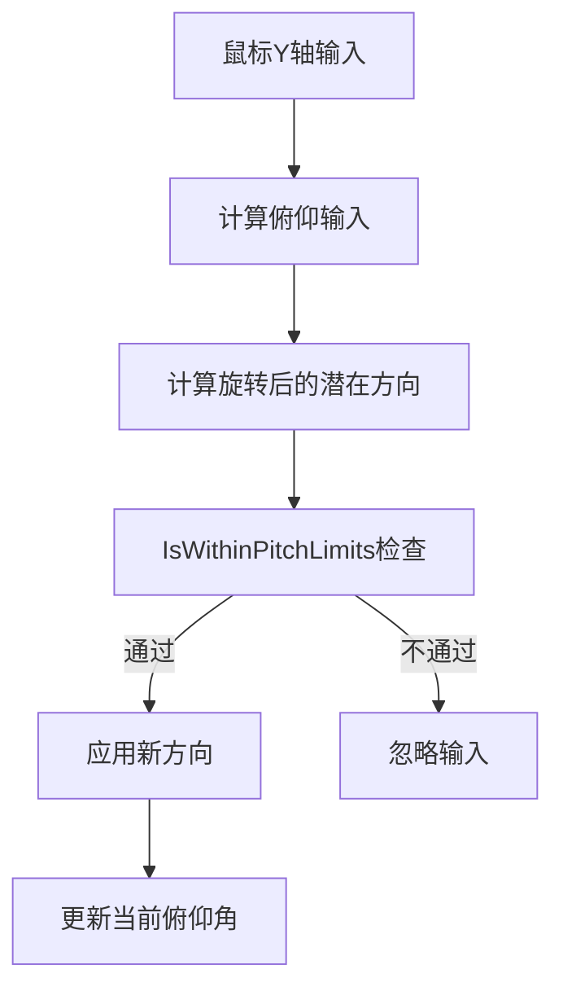
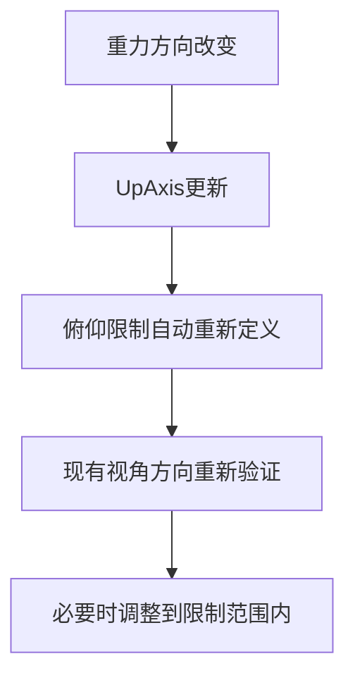

# PlayerView 重力适应性视角限制系统

## 问题背景

在动态重力环境中，原有的固定角度俯仰限制（-88° 到 88°）存在以下问题：

1. **重力方向无关性**：限制基于固定的世界坐标轴，不随重力变化调整
2. **不直观的控制**：当玩家倒挂在天花板时，"向上看"和"向下看"的概念完全颠倒
3. **限制失效**：在某些重力方向下，限制可能完全失去意义

## 解决方案

### 🔄 **基于重力方向的动态限制**

将固定的角度限制替换为基于当前重力方向的动态计算：

```csharp
// 原有方式（固定角度）
[Range(-90f, 0f)] private float _minPitch = -88f;
[Range(0f, 90f)] private float _maxPitch = 88f;

// 新方式（相对重力）
[Range(0f, 90f)] private float _maxPitchUp = 88f;    // 朝"天空"看的限制
[Range(0f, 90f)] private float _maxPitchDown = 88f;  // 朝"地面"看的限制
```

### 🧭 **智能俯仰角检查**

#### `IsWithinPitchLimits(Vector3 direction)`

```csharp
private bool IsWithinPitchLimits(Vector3 direction)
{
    // 1. 将方向投影到重力水平面
    Vector3 directionOnPlane = Vector3.ProjectOnPlane(direction, _motor.UpAxis).normalized;
    
    // 2. 计算相对于水平面的俯仰角
    float pitchAngle = Vector3.SignedAngle(directionOnPlane, direction, 
        Vector3.Cross(_motor.UpAxis, directionOnPlane));
    
    // 3. 检查是否在允许范围内
    return pitchAngle >= -_maxPitchDown && pitchAngle <= _maxPitchUp;
}
```

**关键特性：**
- **重力感知**：基于 `_motor.UpAxis`（当前重力方向）计算
- **相对水平面**：俯仰角相对于当前的"水平面"，而不是世界坐标
- **正负含义明确**：正角度 = 向上看，负角度 = 向下看

### 📐 **俯仰角计算**

#### `CalculateCurrentPitch(Vector3 direction)`

```csharp
private float CalculateCurrentPitch(Vector3 direction)
{
    Vector3 directionOnPlane = Vector3.ProjectOnPlane(direction, _motor.UpAxis).normalized;
    
    if (directionOnPlane == Vector3.zero) return 0f;
    
    return Vector3.SignedAngle(directionOnPlane, direction, 
        Vector3.Cross(_motor.UpAxis, directionOnPlane));
}
```

**用途：**
- 调试信息显示
- 状态追踪
- 与其他系统的接口

## 应用场景示例

### 场景1：正常重力（UpAxis = Vector3.up）
- **向上看 88°**：玩家可以看向天空，接近垂直向上
- **向下看 88°**：玩家可以看向地面，接近垂直向下
- **行为**：与传统FPS游戏一致

### 场景2：倒转重力（UpAxis = Vector3.down）
- **向上看 88°**：相对于玩家现在的"上方"（原来的下方）
- **向下看 88°**：相对于玩家现在的"下方"（原来的上方）
- **行为**：控制感觉保持一致，但实际方向已适应新重力

### 场景3：侧向重力（UpAxis = Vector3.right）
- **向上看 88°**：朝向重力的"上方"
- **向下看 88°**：朝向重力的"下方"
- **行为**：玩家在墙上行走时的自然视角控制

## 处理流程

### 输入处理流程



### 重力变化适应



## 代码对比

### 原有实现（固定限制）
```csharp
// 简单的角度限制
float newPitch = _currentPitch + pitchInput;
newPitch = Mathf.Clamp(newPitch, _minPitch, _maxPitch);

if (newPitch != _currentPitch) {
    // 应用旋转...
}
```

### 新实现（重力适应）
```csharp
// 基于向量的智能限制
Vector3 potentialNewDirection = RotateVectorAroundAxis(
    _currentAimDirection, currentRight, pitchInput);

if (IsWithinPitchLimits(potentialNewDirection)) {
    _currentAimDirection = potentialNewDirection;
    _currentPitch = CalculateCurrentPitch(_currentAimDirection);
}
```

## 配置说明

### Unity Inspector 设置

```
视角控制:
├── Look Sensitivity: 1.0
├── Max Pitch Up: 88°     // 向"天空"看的最大角度
├── Max Pitch Down: 88°   // 向"地面"看的最大角度
└── Invert Y: false
```

### 调参建议

- **一般FPS游戏**：Up=88°, Down=88°
- **限制性环境**：Up=60°, Down=60°
- **自由探索**：Up=89°, Down=89°
- **特殊玩法**：Up=45°, Down=75°（例如强调向下观察）

## 性能考虑

### 优化点
- **向量投影计算**：使用了高效的Unity内置方法
- **条件检查**：只在需要时进行复杂计算
- **缓存结果**：俯仰角计算结果被缓存

### 计算复杂度
- **IsWithinPitchLimits**：O(1) - 几个向量运算
- **CalculateCurrentPitch**：O(1) - 简单的角度计算
- **总体影响**：几乎可忽略

## 调试支持

### 调试信息
```csharp
string info = $"[PlayerView-Vector] Pitch: {_currentPitch:F1}°";
info += $"\nAim Direction: {_currentAimDirection:F2}";
info += $"\nGravity Up Axis: {_motor.UpAxis:F2}";
```

### Gizmos 可视化
- 红线：当前瞄准方向
- 蓝线：身体前向
- 黄球：AIM目标位置

## 总结

这个改进实现了：

✅ **重力感知的视角限制** - 始终相对于当前重力方向  
✅ **直观的控制体验** - "向上"和"向下"概念保持一致  
✅ **无缝重力过渡** - 重力变化时自动适应  
✅ **高性能实现** - 基于高效的向量运算  
✅ **易于配置** - 清晰的参数设置  

这为复杂的重力环境提供了自然且直观的视角控制体验。
