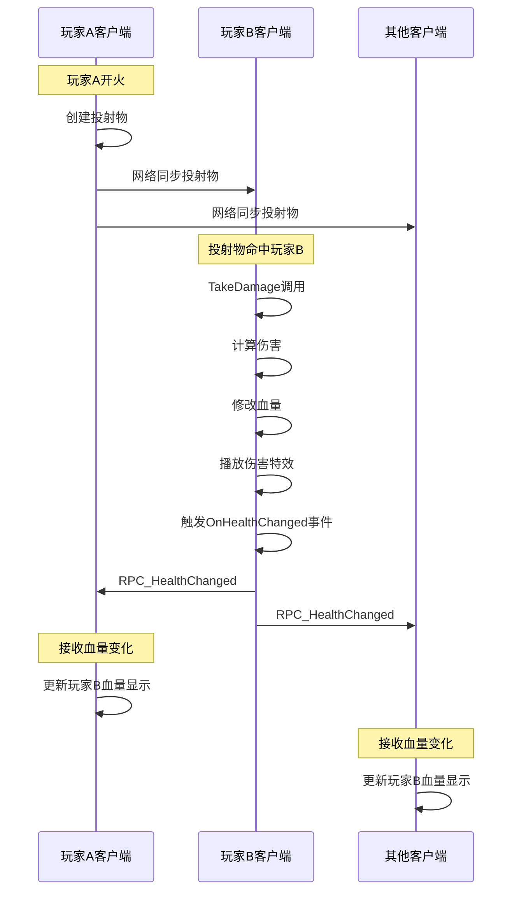

# 伤害处理逻辑修复报告

## 问题识别

用户发现了一个关键的逻辑错误：

```csharp
// 错误的逻辑
if (!photonView.IsMine || !_isAlive || damage <= 0)
{
    if (!photonView.IsMine) Debug.Log($"跳过伤害：不是本地玩家");
    return; // 远程玩家永远不会受到伤害！
}
```

### 问题分析

**原始逻辑的问题**：
1. **远程玩家无法受到伤害**：只有`photonView.IsMine = true`的玩家才能受伤
2. **违反设计原则**：与"本地计算伤害，同步血量变化"的架构不符
3. **实际表现**：玩家只能伤害自己，无法伤害其他玩家

**为什么这样不对**：
- 投射物在命中玩家时，会在所有客户端上调用`IDamageable.TakeDamage`
- 但原始逻辑会让非拥有者的客户端直接跳过伤害处理
- 结果是远程玩家永远不会受到伤害

## 新的伤害处理流程

### 设计原则

1. **任何客户端都可以计算伤害**：投射物命中时，在所有客户端上都能触发伤害计算
2. **只有拥有者才能修改血量**：防止血量数据冲突和不一致
3. **视觉效果在所有客户端播放**：保证视觉反馈的一致性
4. **血量变化通过RPC同步**：确保所有客户端的血量显示一致

### 新的处理流程

#### 1. 基本验证（所有客户端）
```csharp
// 检查基本条件：存活状态和伤害值有效性
if (!_isAlive || damage <= 0)
{
    return; // 无效伤害，直接返回
}
```

#### 2. 远程玩家处理
```csharp
if (!photonView.IsMine)
{
    // 远程玩家：只播放伤害特效，不修改血量
    PlayDamageEffects(hitPoint, hitDirection, damage);
    return; // 血量变化将通过RPC同步
}
```

#### 3. 本地玩家处理（拥有者）
```csharp
// 本地玩家：完整的伤害处理流程
// 1. 防作弊检查
if (_enableAntiCheat && !ValidateDamageRequest(damage))
    return;

// 2. 修改血量
_currentHealth = Mathf.Max(0, _currentHealth - damage);

// 3. 触发本地事件
OnHealthChanged?.Invoke(_currentHealth, _maxHealth);

// 4. RPC同步到其他玩家
photonView.RPC("RPC_HealthChanged", RpcTarget.Others, _currentHealth);

// 5. 播放伤害特效
PlayDamageEffects(hitPoint, hitDirection, damage);

// 6. 检查死亡
if (_currentHealth <= 0 && _isAlive)
    HandleDeath();
```

## 完整的数据流向

### 场景：玩家A射击玩家B



### 各客户端的处理

#### 玩家A客户端（射击者）
- 创建和发射投射物
- 接收玩家B的血量变化RPC
- 更新UI显示玩家B的血量

#### 玩家B客户端（被击者，拥有者）
- 投射物命中时执行完整伤害处理
- 修改自己的血量
- 播放伤害特效
- 通过RPC同步血量变化

#### 其他客户端（观察者）
- 接收投射物网络同步
- 接收玩家B的血量变化RPC
- 更新UI显示

## 关键改进

### 1. 逻辑修正
**之前**：
```csharp
if (!photonView.IsMine) return; // 错误：远程玩家无法受伤
```

**现在**：
```csharp
if (!photonView.IsMine) {
    PlayDamageEffects(hitPoint, hitDirection, damage);
    return; // 正确：播放特效但不修改血量
}
```

### 2. 职责分离
- **远程客户端**：伤害计算 + 视觉特效
- **拥有者客户端**：伤害计算 + 血量修改 + 网络同步 + 视觉特效

### 3. 一致的视觉反馈
- 所有客户端都会播放伤害特效
- 确保视觉反馈的一致性和即时性

### 4. 防作弊保护
- 只在拥有者端进行防作弊检查
- 避免在所有客户端重复检查

## 测试验证

### 功能测试
- [ ] 玩家A能够伤害玩家B
- [ ] 玩家B能够伤害玩家A
- [ ] 血量变化在所有客户端正确显示
- [ ] 伤害特效在所有客户端播放

### 多人测试
- [ ] 3人以上游戏中的伤害处理
- [ ] 同时多个玩家受伤的处理
- [ ] 网络延迟下的表现

### 边界测试
- [ ] 玩家自伤（如果允许）
- [ ] 死亡状态下的伤害处理
- [ ] 无效伤害值的处理

## 潜在问题和解决方案

### 1. 重复特效播放
**问题**：同一个投射物可能在多个客户端播放特效
**解决**：在投射物级别控制特效播放，避免重复

### 2. 网络延迟
**问题**：RPC延迟可能导致血量显示不同步
**解决**：使用NetworkSync作为备份验证（已实现）

### 3. 数据不一致
**问题**：如果RPC丢失，血量可能不同步
**解决**：NetworkSync的备份验证机制会检测并警告

## 性能影响

### 正面影响
- **减少无效处理**：远程玩家不进行完整的伤害计算流程
- **明确的职责分工**：每个客户端只处理必要的部分

### 需要监控
- **RPC频率**：大量伤害时的网络负载
- **特效性能**：所有客户端播放特效的性能影响

---

**修复日期**: 2025年6月26日  
**修复人员**: GitHub Copilot  
**影响范围**: PlayerStatusManager.cs - TakeDamage方法  
**优先级**: 高（核心游戏逻辑）  
**测试建议**: 立即进行多人伤害测试验证修复效果
